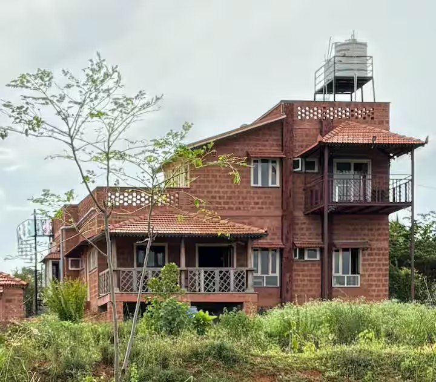

# 🌿 JSK Farmstay — Immersive Villa Experience Website

> A modern, nature-focused web experience designed for an eco-conscious private villa near the KRS backwaters.

<p align="center">
  
</p>

<p align="center">
  <strong>A visual-first website combining immersive storytelling, responsive UI, and an eco-luxury aesthetic.</strong>
</p>

---

## 🌱 About the Project

**JSK Farmstay** is a frontend web project created to showcase a private, nature-oriented villa and its surrounding experience.

Instead of building a conventional property-listing website, the project focuses on **visual storytelling** — allowing visitors to understand the atmosphere, architecture, accommodation, amenities, and philosophy of the property through an immersive digital experience.

The website presents the villa as a destination centered around:

- 🌿 Nature
- 🏡 Sustainable architecture
- 🌊 The KRS backwaters
- 🧘 Privacy and relaxation
- 👨‍👩‍👧‍👦 Family experiences
- 💻 Workations
- 🍲 Local food
- 🐾 Pet-friendly stays

---

# ✨ Key Features

## 🏡 Immersive Villa Landing Page

The website opens with a strong visual introduction to the property, immediately establishing the relationship between the villa and its natural surroundings.

The layout uses large imagery and spacious sections to create a premium, editorial-style experience.

---

## 📸 Visual Storytelling

The website uses imagery as a primary storytelling mechanism.

Visitors can explore:

- Villa interiors
- Exterior architecture
- Natural surroundings
- Garden and outdoor spaces
- Property atmosphere

The gallery is integrated into the page rather than being treated as a separate image catalogue.

---

## 🌱 Eco-Conscious Architecture

A dedicated section explains the property's sustainability-oriented design.

The website highlights:

- Natural laterite stone construction
- Reduced cement usage
- Eco-friendly cow-dung paint
- Natural cross-ventilation
- Large meshed windows
- Connection with the surrounding environment

This section helps communicate the architectural philosophy behind the property rather than simply listing amenities.

---

## 🛏️ Accommodation Experience

The website presents the villa's accommodation in a structured and easy-to-understand format.

### Property

| Feature | Details |
|---|---|
| Property | JSK Farmstay |
| Property Type | Private Villa / Farmstay |
| Property Size | 2 acres |
| Villa Size | ~2,000 sq ft |
| Bedrooms | 3 |
| Capacity | Up to 8 guests |
| Parking | Secure |
| Garden | Private |

### Sleeping Arrangements

The villa provides:

- Ground-floor bedroom
- First-floor bedroom
- Queen bed
- Two single beds
- Sofa-cum-beds
- Additional mattresses when required

The property also includes:

- 2 modern bathrooms
- 1 traditional Handeole

---

# 💻 Workation-Friendly Experience

The website doesn't position the property solely as a holiday destination.

It also highlights its suitability for remote work through:

- High-speed fiber internet
- UPS backup
- Quiet surroundings
- Dedicated work-friendly environment

This allows the property to appeal to visitors looking for a combination of **work + nature + relaxation**.

---

# 🎮 Leisure & Entertainment

The experience section highlights activities available within the property, including:

- 🎲 Indoor board games
- 🎯 Dartboard
- 📚 Books
- 🌳 Outdoor spaces
- 🦚 Natural surroundings

---

# 🍲 Food Experience

The website communicates the property's conscious food philosophy.

Guests can request vegetarian meals prepared by the caretaker, subject to advance notice.

The experience emphasizes:

- Farm-fresh vegetables
- Locally sourced ingredients
- Organic turmeric
- Pure ghee
- Traditional local cuisine

The property also uses natural **shikakai** for cleaning utensils as part of its conscious-living approach.

> Guest cooking is not permitted.

---

# 🌳 Nature & Outdoor Experience

The website emphasizes the property's connection to nature.

Key elements include:

- 2-acre private property
- Private garden
- Private patio
- Natural surroundings
- Resident peacocks
- KRS backwaters approximately 100 m away

The outdoor environment is treated as an important part of the overall experience rather than simply background scenery.

---

# 🎨 Design Philosophy

The UI follows a **nature-first, premium editorial aesthetic**.

### Design Principles

**Visual First**

Large imagery is used to establish the atmosphere before presenting detailed information.

**Minimal Interface**

The design avoids unnecessary UI elements and allows the property itself to remain the focus.

**Storytelling**

Information is structured as a journey:

```text
Introduction
      ↓
Property
      ↓
Architecture
      ↓
Accommodation
      ↓
Work & Leisure
      ↓
Food
      ↓
Nature
      ↓
Experience
